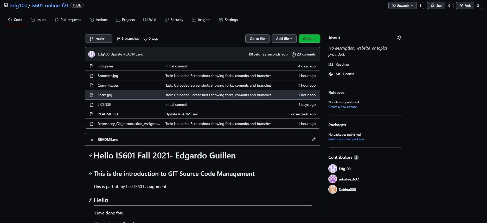
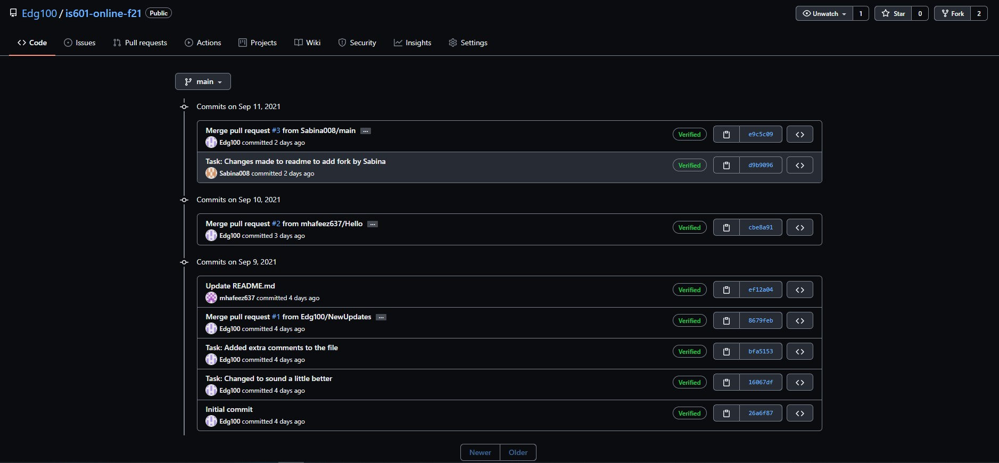
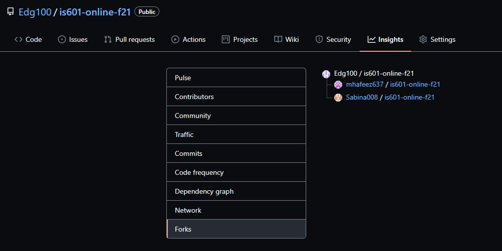
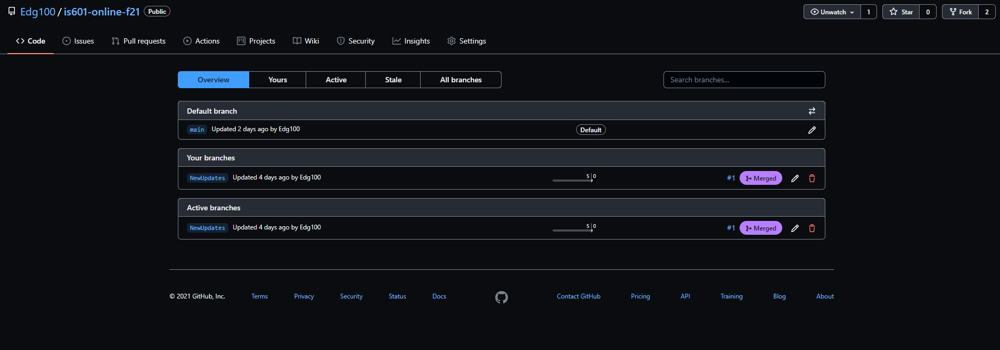

# Hello IS601 Fall 2021- Edgardo Guillen
## This is the introduction to GIT Source Code Management
This is part of my first IS601 assignment
## Hello 
-Have done fork

-Created a new Branch

-Making someChanges to Readme file

# Hi this is Sabina
# Completed a fork, commits and branches

## This is a screenshot showing the entire repository (IS601-online-f21)

## This is screenshot for Commits

## This is a screenshot showing fork

## This is a screenshot showing Branches

